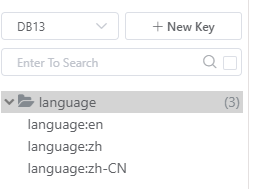
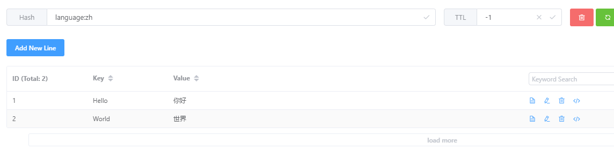
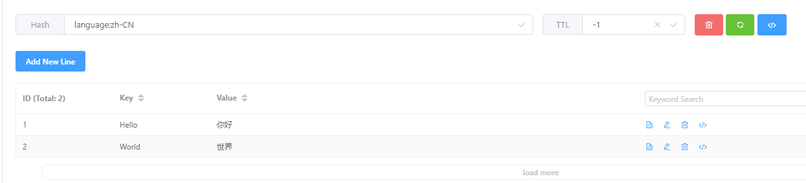

往 Redis 填充多语言数据，使用 `{前缀}:{语言名称}` 的形式存储 Key，每个 Key 均是 Hash 类型。



使用编程填充数据如下所示：
```csharp
			RedisClient redisClient = new RedisClient("127.0.0.1:6379,defaultDatabase=13");

			await redisClient.HMSetAsync("language:en", new Dictionary<string, string>
			{
				{ "Hello", "Hello" },
				{ "World", "World"},
			});
			await redisClient.HMSetAsync("language:zh-CN", new Dictionary<string, string>
			{
				{ "Hello", "你好" },
				{ "World", "世界" },
			});
			await redisClient.HMSetAsync("language:zh", new Dictionary<string, string>
			{
				{ "Hello", "你好" },
				{ "World", "世界" },
			});
```







在 ABP 中初始化 RedisClient 和多语言配置：

```csharp
			// 将 RedisClient 注册为单例
			RedisClient cli = new RedisClient("127.0.0.1:6379,defaultDatabase=13");
			context.Services.AddSingleton<RedisClient>(cli);
			context.Services.AddSingleton<LanguageRedisOptions>(s =>
			{
				return new LanguageRedisOptions
				{
                    // Key 前缀
					KeyPrefix = "language",
                    // 缓存的 Key 数量
					Capacity = 20,
                    // 多长时间不使用缓存将被从本地中清除
					CheckExpired = TimeSpan.FromHours(1)
				};
			});
```


然后在按照 ABP 配置多语言时，使用 Redis 即可。

```csharp
			// 从容器中取出单例，避免每个模块都 new 一个新的 RedisClient
			var redisClient = context.Services.GetRequiredService<RedisClient>();
			var languageRedisOptions = context.Services.GetRequiredService<LanguageRedisOptions>();

			Configure<AbpLocalizationOptions>(options =>
			{
				options.Resources
					.Add<TestResource>("en")
					// 注入 Redis 多语言
					.AddFreeRedis(redisClient, languageRedisOptions)
					.AddVirtualJson("/Localization/Resources/Test");
			});
```


因为 ABP 多语言需要每个程序集的模块都初始化一次，因此为了避免每个程序集都做本地缓存，我们需要确保配置多语言资源提供器时，使用同一个 RedisClient 对象。

